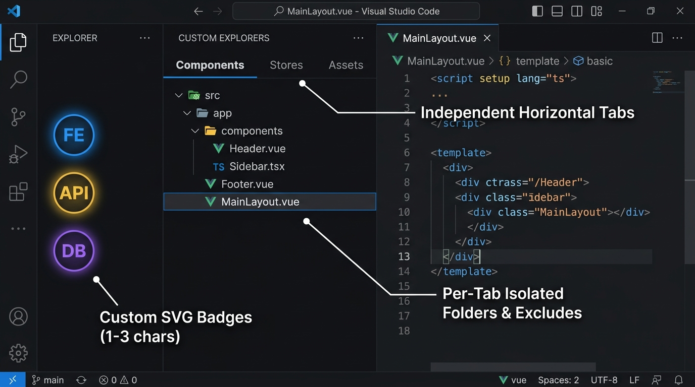

# Custom Explorers for Visual Studio Code

> **Monorepos, microservices, and full-stack projects overwhelm the single default VS Code file tree.**  
> **Custom Explorers** splits your workspace into **up to 10 dedicated, high-performance file explorers** in your Activity Bar — each featuring horizontal multi-tabs, custom badge icons, per-tab exclusions, and instant switching.

---

---

## Why Custom Explorers?

Working on complex multi-package repositories or full-stack applications forces you to constantly collapse, expand, and scroll through hundreds of unrelated directories.

Custom Explorers replaces that friction with **modular, context-isolated workspaces**:
- Keep **Frontend (`FE`)**, **Backend (`API`)**, **Infrastructure (`OPS`)**, and **Docs** separated into dedicated Activity Bar views.
- Group related folders under **horizontal tabs** inside each explorer.
- Enjoy a clean workspace with **zero background resource drain**.

---

## Key Highlights

### 🗂️ Up to 10 Dedicated Activity Bar Explorers
- Configure up to **10 independent file trees** directly on your Activity Bar.
- Each explorer operates in complete isolation: distinct tabs, independent folder scopes, and preserved expansion states.
- Unused slots automatically stay hidden via dynamic VS Code context keys.

### 🏷️ Dynamic SVG Badges ("Your Name Is Your Icon")
- No generic, repetitive folder icons. Simply name a bar (`FE`, `API`, `DB`, `UI`, `1`..`10`), and Custom Explorers generates a crisp, high-contrast SVG folder badge directly on your Activity Bar button.

### 📑 Infinite Horizontal Multi-Tabs
- Organize folders within an explorer using compact, wrapping horizontal tabs (25px height).
- Each tab maintains its own mounted folders and remembers expanded directory trees across sessions.

### 🛡️ Per-Tab Exclude Scopes (`files.exclude`)
- Isolate build artifacts and noisy folders per tab without affecting global editor settings:
  - **Inherit Mode:** Combines your global VS Code `files.exclude` with tab-specific glob patterns.
  - **Custom Mode:** Enforces only tab-specific patterns (e.g., hiding `node_modules`, `dist`, or generated artifacts).
  - Quick inline toggle to show or hide excluded files on the fly.

### 🌐 Mount Folders from Any Drive or Workspace
- Add directories directly from the active multi-root workspace or mount any path from local drives (`C:\`, `D:\`, `/home/...`).
- Safe cross-platform normalization ensures drive roots and POSIX paths display and navigate reliably.

### 🎯 Workspace-Aware Visibility
- Enable **Filter by Workspace** to automatically show only the explorer bars containing folders from the currently opened project. When you switch projects, your Activity Bar adapts instantly.

### ⚡ Built on Vue 3.6 Vapor Mode
- **No Virtual DOM:** Templates compile directly into native DOM manipulation instructions.
- **Ultra-low memory & CPU footprint:** Inactive bars and background tabs consume **0% CPU** and drop filesystem watchers.
- **Microscopic bundle size:** The entire Webview UI is packed into just **~31 KB gzip** (~89 KB uncompressed) with zero third-party UI framework bloat.

### 🎛️ Centralized Manager & Storage Diagnostics
- Configure all 10 slots with live SVG previews in a unified dashboard.
- Built-in diagnostics utility monitors `globalState` footprint, tests IPC round-trip latency, verifies disk read performance, and cleans orphaned cache entries in one click.

---

## Quick Start

1. Click **`$(layers) Explorers`** in the status bar or the toolbar icon to open the **Manager Dashboard**.
2. Assign names to your slots (e.g. `FE`, `API`).
3. Add folders via the **`+`** button or context menu.

---

## License

Distributed under the [Apache-2.0 License](LICENSE).
